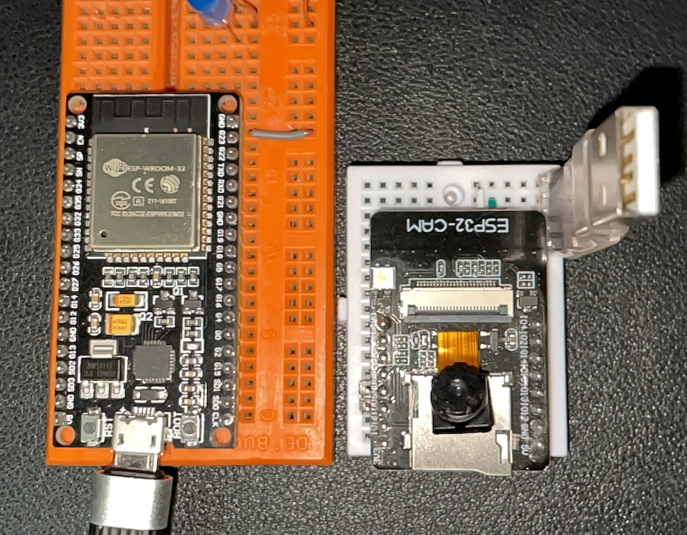
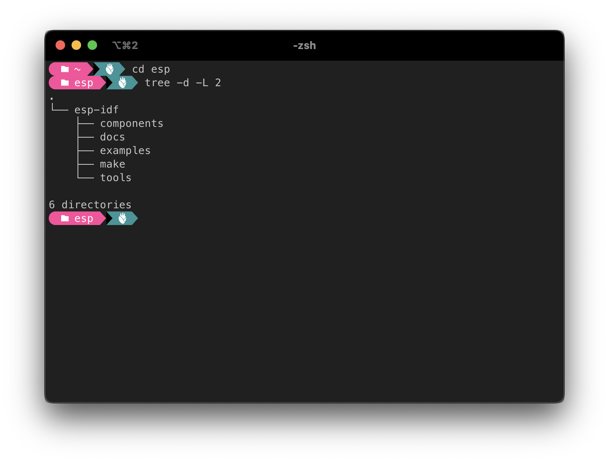

# My ESP32 Playground

After a long period of inactivity, I decided to pull two microcontrollers from the ESP32 family out of the drawer and play with them in my spare time.

The first (and the oldest one) is an ESP-WROOM-32 development board.

The other one is an ESP32-CAM.

There are a few ways to write code runnable on a ESP3. 

one based on Python programming language

- [Micropython](https://micropython.org/download/esp32/)

other two are C/C++ based:

- [Arduino ESP32](https://docs.espressif.com/projects/arduino-esp32/en/latest/getting_started.html);
- [Espressif IoT Development platform](https://idf.espressif.com/) also known as IDF;

My first device programming experiments will be with the latter of the two, IDF, firstly because it's the one with its implementation of [FreeRTOS](https://www.freertos.org/).

 

## Environment setup

### IDF IoT Development Framework

Following the guidelines available in the [official](https://docs.espressif.com/projects/esp-idf/en/stable/esp32/get-started/index.html#installation-step-by-step) documentation](https://docs.espressif.com/projects/esp-idf/en/stable/esp32/get-started/index.html#installation-step-by-step), it's easy enough to set up a ready-to-use development framework for any major operating system type.

After the setup process, something like that should appear on the file system.

