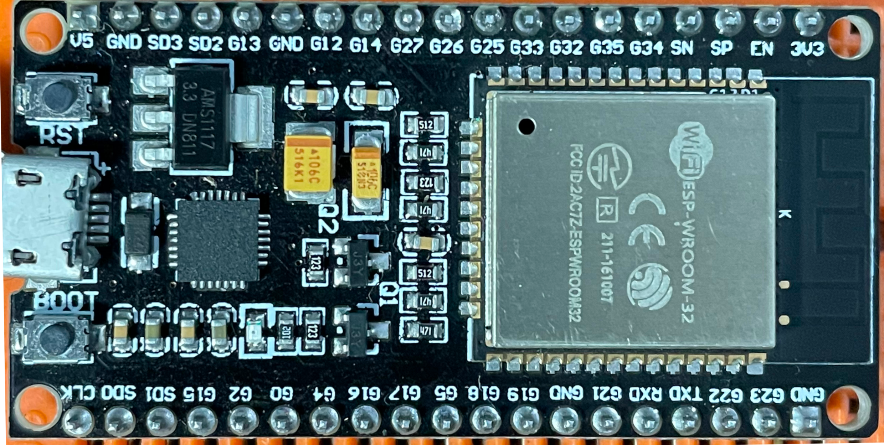

# My ESP32 Playground

After a long period of inactivity, I decided to pull two microcontrollers from the ESP32 family out of the drawer and play with them in my spare time.

The first (and the oldest one) is an ESP-WROOM-32 development board

|                                         |                                   |
| --------------------------------------- | --------------------------------- |
|  |  |

The other one is an ESP32-CAM

